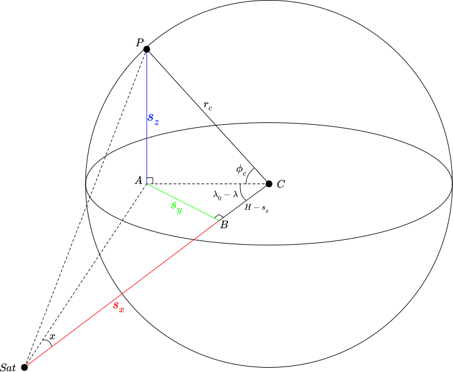
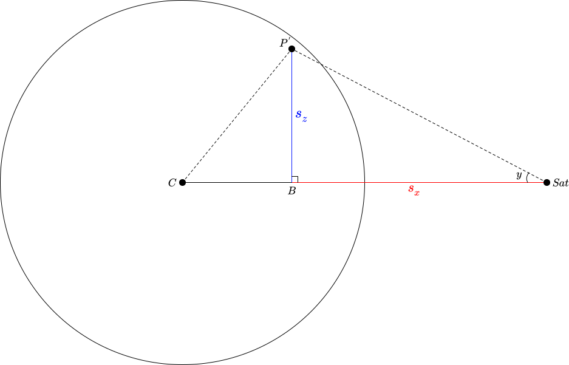

# LiveMarble

This project aims to provide a real-time view of the globe using satellite imagery. While there are many excellent viewers for both satellite imagery, there's a surprising lack of a way to easily display live data in a 3D globe visualization.

On one hand, you have excellent satellite imagery viewers, many including live data from geostationary satellites.

- [SLIDER by RAMMB / CIRA @ CSU](https://rammb-slider.cira.colostate.edu) provides live data from many satellites including Himawari and Meteosat, but only images and without easy download links
- [RAMMB / CIRA](https://rammb.cira.colostate.edu/ramsdis/online/himawari-8.asp) has download links for GOES and Himawari full-disk imagery on their website, but not Meteosat
- [NOAA STAR](https://www.star.nesdis.noaa.gov/GOES/index.php) provides GOES imagery
- [EUMETSAT](https://eumetview.eumetsat.int/static-images/latestImages/) provides Meteosat images, but most have annotations or enhancements applied 
- [NASA WorldView](https://worldview.earthdata.nasa.gov/) has beautiful stitched views combining multiple satellites, but only displays a 2D projection.

On the other hand, you have mapping software that provides a 3D globe visualization but doesn't use live data.

- [Google Earth](https://earth.google.com/web/)
- [Apple Maps](https://support.apple.com/guide/iphone/view-maps-iph10d7bdf26/ios) on some devices

# Satellites

For this visualization, temporal resolution and coverage is much more important than spatial resolution. As a result, geostationary weather satellites are the ideal data source as they provide frequent imagery of a large swath of the Earth. The [World Meteorological Organization](https://space.oscar.wmo.int/gapanalyses?mission=2) provides an excellent listing of all weather satellites in operation, although finding the actual imagery is its own challenge. NOAA has [its own listing](https://www.nesdis.noaa.gov/current-satellite-missions/currently-flying) of satellites it manages.

One other notes is that the imagers on weather satellites aren't optimized to provide night-time imagery. Instead, most night-time imagery is constructed from IR cloud data overlayed over some fixed backdrop, most often the [Black Marble](https://earthobservatory.nasa.gov/features/NightLights) composite. There are a few satellites with public night-time imagery. However these weren't included in this version of the page to avoid the complexity of interpolating between live geostationary imagery and polar imagery captured up to a day apart.

- [Suomi National Polar Partnership (SNPP) VIIRS](https://ngdc.noaa.gov/eog/viirs/download_ut_mos.html)
- [Defense Meteorological Satellite Program (DMSP)](https://eogdata.mines.edu/products/dmsp/) has some excellent historical night-time light data, although it appears the data is only available through 2013.

# Geometry

The primary technical challenge is to project the "full-disk images" as downloaded from the satellite imagery providers onto a globe. More specifically, we are performing UV texture mapping from onto a sphere. The [GOES-R Product Definition and User Guide (Volume 3: Level 1B Products)](https://www.goes-r.gov/users/docs/PUG-L1b-vol3.pdf) provides formulas for mapping from image coordinates to and from geodetic latitude/longitude in section 5.1.2.8. However the formula and constants are given without derivation or much explanation. This section first presents a more detailed walkthrough of the NOAA method in case anyone else is wondering where all these numbers came from, followed by some optimizations used in the visualizations.

## NOAA method

The mapping we are interested in is from geodetic coordinates to image coordinates, since we will be executing this in the geometry shader to map from a UV coordinate on the sphere to a texture coordinate to sample from the image. The general approach presented in 5.1.2.8.2 is to calculate the position of a given latitude/longitude $(\lambda,\phi)$ on the Earth in the satellite's camera's coordinates $(s_x, s_y, s_z)$ in meters. Then these camera coordinates is converted into scan angles, which can be directly looked up in the full disk image. Note that the formula presented in the user guide also provides for correction from GRS80 latitude/longitude to geocentric latitude/longitude to account for the oblateness of the Earth, but for simplicity this will be omitted in this visualization. I.e. we are setting $\phi_c = \phi$.

$s_z$ can be directly calculated from basic trigonometric relations as $r_c \sin(\phi_c)$. Similarly the length of segment $\overline{AC}$ is $r_c \cos(\phi_c)$. Then with segment $\overline{AC}$ as the hypotenuse of triangle ABC we can find $s_y = (r_c \cos(\phi_c)) \sin(\lambda_0 - \lambda) = -r_c \cos(\phi_c)\sin(\lambda - \lambda_0)$. Note that the user manual transforms the angle term $\sin(\lambda_0 - \lambda)$ to $-\sin(\lambda - \lambda_0)$ for some reason, the key here is that points to camera right from the satellite's perspective are positive y. Finally, the length of segment $\overline{BC}$ is $H-s_x = (r_c \cos(\phi_c)) \cos(\lambda_0 - \lambda)$, therefore $s_x = H - r_c \cos(\phi_c)\cos(\lambda - \lambda_0)$.

Note that the scan angles are calculated in order elevation (N/S) first, then azimuth (E/W) if you think of them as Euler angles. If we construct point $P'$ by projecting the pointer $P$ onto the $\lambda = \lambda_0$ plane, then the vertical scan angle $y = arctan(s_z / s_x)$. The horizontal scan angle $x$ is defined in terms of the right triangle formed by $P$, $P'$, and the satellite $Sat$. In particular, the length of segment $PP'$ is $s_y$, and the length of the hypotenuse between $P$ and the satellite is $\sqrt{s_x^2 + s_y^2 + s_z^2}$ giving the final expression $x = \arcsin(-s_y / \sqrt{s_x^2 + s_y^2 + s_z^2})$.

## GLSL Implementation

One thing to note is that three.js uses a Y-up coordinate system. So in three.js $s_x$ is along the z axis, $s_y$ is along the x axis, and $s_z$ is along the y axis. I'm sticking with the NOAA coordinate system for the following discussion, just be aware the axes will be different in the GLSL code.

We can vectorize much of the coordinate converion work in the GLSL implementation by taking advantage of the fact that the geometry shader has access to the generated normal vector, which is simply a radial vector since we are mapping onto a sphere. By rotating the normal vector by the angle corresponding to the satellite's longitude, we have a unit vector pointing in the direction of $\overrightarrow{CP}$ in the above diagram. This gives us $s_y$ and $s_z$ directly, albeit in units of Earth radii. Finally we can get $s_x$ by subtracting the $x$ component of the rotated normal vector from $H/r_c$.

For the calculation of the final scan angles, I did a small change to the calculation of the horizontal scan angle (x) by using the triangle $ABSat$ instead of the rotated triangle. Thus $x = arctan(s_y/s_x)$. This is slightly more performant as we can vectorize the calculation together with the calculation of $y$ and it subjectively seems to partially cancel out the error from assuming a spherical Earth.

# Citations
Beyond the satellite imagery sources cited above, the following resource were used:

- [three.js](https://threejs.org/) Javascript 3D framework
- [OrbitControls](https://threejs.org/docs/#examples/en/controls/OrbitControls) from three.js
- [Deep star map from NASA/Goddard Space Flight Center Scientific Visualization Studio](https://svs.gsfc.nasa.gov/4851) used as skybox
